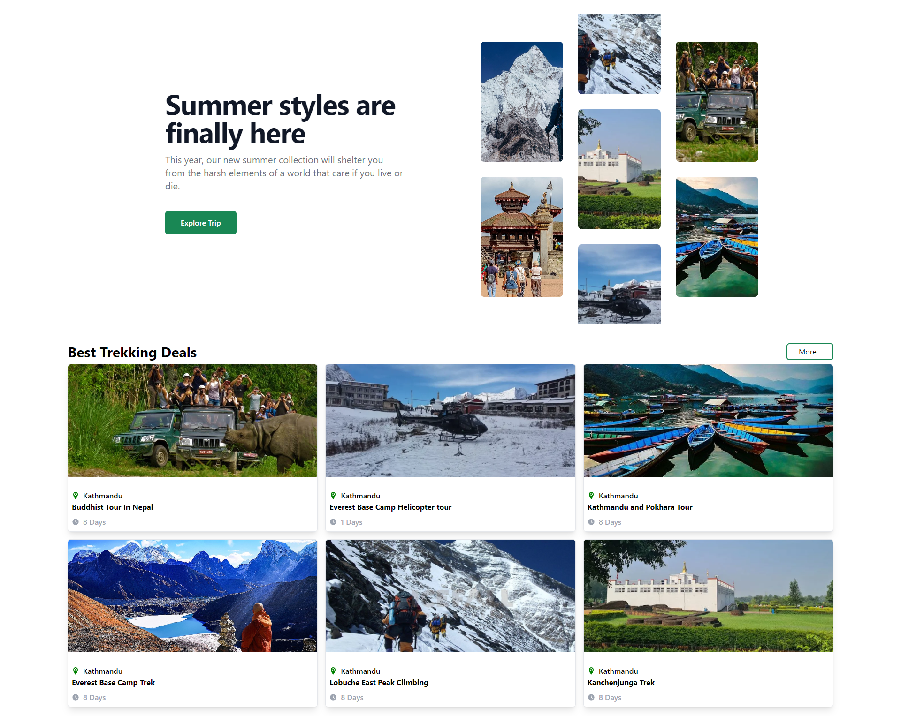

 <h1>Explore and Trek in Nepal</h1>

<h2>Description</h2>

        The <strong>Explore and Trek in Nepal</strong> is a frontend application built using <strong>ReactJS</strong> and <strong>Tailwind CSS</strong>.
        It features a design, feature trip section, blog section and slider. User can click on trip and can view the full details of that trip and also able to book a trip.
    

<h2>Screenshots</h2>

Here are some screenshots of the application in action:

        
        
    

<h2>Features</h2>
<ul>
        <li>login and signup page</li>
        <li>Product listing on the home page</li>
        <li>View detailed information about each product</li>
        <li>Add products to the shopping cart</li>
        <li>View and manage items in the shopping cart</li>
    </ul>

<h2>Installation</h2>

Follow these steps to get the project running on your local machine:

<ol>
        <li>
            <strong>Clone the repository:</strong>
            <pre><code>git clone https://github.com/sulochanbarakoti/Ecommerce_web_application.git

cd Ecommerce_web_application
</code></pre>

</li>
<li>
<strong>Install dependencies:</strong>
<pre><code>npm install
</code></pre>
</li>
<li>
<strong>Start the development server:</strong>
<pre><code>npm start
</code></pre>

The application will be available at <code>http://localhost:3000</code>.

</li>
</ol>

<h2>Usage</h2>
<ol>
        <li>
            <strong>Login/Signup:</strong>
            
Navigate to the login or signup pages to access or create an account.

        </li>
        <li>
            <strong>Home Page:</strong>
            
Browse through the list of available products.

        </li>
        <li>
            <strong>Product Details:</strong>
            
Click on a product to view more details about it.

        </li>
        <li>
            <strong>Shopping Cart:</strong>
            
Add products to your cart and view/manage items within the cart.

        </li>
    </ol>

<h2>Components</h2>
<ul>
        <li><strong>Home Page:</strong>
            <ul>
                <li>Product list</li>
            </ul>
        </li>
        <li><strong>Product Details Page:</strong>
            <ul>
                <li>Product information</li>
            </ul>
        </li>
        <li><strong>Shopping Cart Page:</strong>
            <ul>
                <li>Cart items</li>
                <li>Manage cart</li>
            </ul>
        </li>
    </ul>

<h2>Contributing</h2>

If you would like to contribute to this project, please fork the repository and create a pull request with your changes.

<h2>License</h2>

This project is licensed under the MIT License. See the <a href="LICENSE">LICENSE</a> file for more information.

<h2>Contact</h2>

For any inquiries or feedback, feel free to contact the project maintainer at <a href="sulochanbarakoti09@gmailcom">sulochanbarakoti09@gmailcom</a>.

</body>
